<div align="center">

<br/>


# FixIt - Facility Issue Resolution System

**A full-stack enterprise-grade platform for reporting, tracking, and resolving facility maintenance issues.**

<br/>

[](https://openjdk.org/projects/jdk/21/)
[](https://spring.io/projects/spring-boot)
[](https://react.dev/)
[](https://www.postgresql.org/)
[](https://aws.amazon.com/)
[](https://www.keycloak.org/)
[](https://www.docker.com/)
[](https://redux-toolkit.js.org/)

<br/>

</div>

---

## 📋 Table of Contents

- [Overview](#-overview)
- [The Problem It Solves](#-the-problem-it-solves)
- [Architecture](#-architecture)
- [Tech Stack](#-tech-stack)
- [Key Features](#-key-features)
- [User Roles](#-user-roles)
- [Ticket Lifecycle](#-ticket-lifecycle)
- [API Reference](#-api-reference)
- [Security Design](#-security-design)
- [AWS Integration](#-aws-integration)
- [Design Patterns](#-design-patterns)
- [Project Structure](#-project-structure)
- [Local Setup](#-local-setup)
- [Environment Variables](#-environment-variables)
- [Running Tests](#-running-tests)
- [Screenshots](#-screenshots)

---

## 🔍 Overview

FixIt is a **role-based facility issue resolution platform** that digitizes the process of reporting, assigning, and tracking maintenance issues within an organization. Tenants report problems, admins assign them to the right technicians, and technicians resolve them — with full visibility at every step.

Built as a portfolio project targeting the **3–5 YOE level**, it demonstrates production-grade patterns including OAuth2/OIDC authentication, AWS S3 secure file storage, event-driven notifications, state machine lifecycle management, and a fully responsive React frontend.

---

## 🎯 The Problem It Solves

In most organizations, facility issues are reported via WhatsApp, email, or phone calls — with no tracking, no accountability, and no visibility. FixIt replaces this chaos with a structured, auditable, role-based system:

| Without FixIt | With FixIt |
|---|---|
| Issues reported via text/email, no tracking | Every issue has a ticket number, status, and history |
| No way to know if an issue was assigned | Admin assigns tickets to specific technicians |
| Tenants have no update after reporting | Tenants receive email on every status change |
| Photos shared via WhatsApp, lost quickly | Photos stored securely on AWS S3, accessible anytime |
| No data for management decisions | Admin dashboard shows trends by category and priority |

---

## 🏗️ Architecture

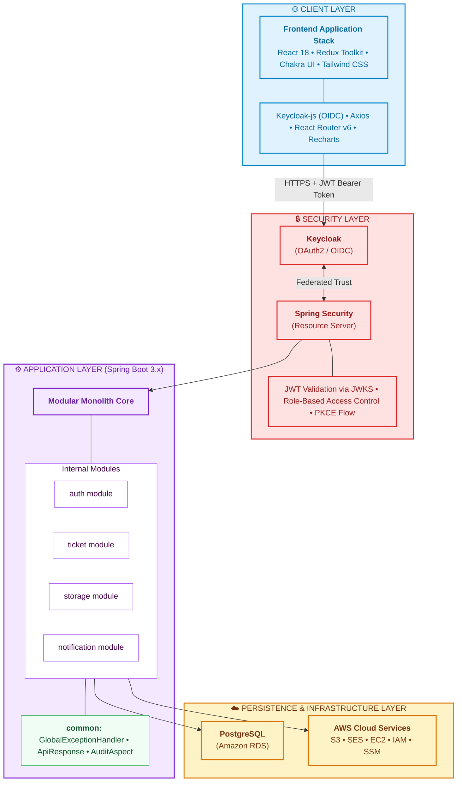

### Why Modular Monolith?

Chosen deliberately over microservices for this scope. Each module (`auth`, `ticket`, `storage`, `notification`) owns its own controller, service, repository, and DTOs — with strict unidirectional dependencies between modules. This means:

- Individual modules can be extracted into separate services with minimal refactoring
- No distributed tracing overhead or inter-service network calls during development
- Cleaner codebase than package-by-layer, more manageable than full microservices

---

## 🛠️ Tech Stack

### Backend

| Category | Technology | Purpose |
|---|---|---|
| Language | Java 21 | Virtual threads, records, sealed classes |
| Framework | Spring Boot 3.x | REST APIs, DI, security, scheduling |
| Security | Spring Security + Keycloak | OAuth2 resource server, JWT validation |
| ORM | Spring Data JPA + Hibernate | Entity mapping, query execution |
| Database | PostgreSQL 15 | Primary relational store |
| Migrations | Liquibase | Versioned, auditable schema changes |
| File Storage | AWS S3 (SDK v2) | Presigned URL upload/download |
| Email | AWS SES | Transactional notification emails |
| Events | Spring ApplicationEventPublisher | Async observer pattern |
| API Docs | SpringDoc OpenAPI 3 | Swagger UI auto-generation |
| Testing | JUnit 5 + Mockito + Testcontainers | Unit, integration, API tests |
| Build | Maven | Dependency management |

### Frontend

| Category | Technology | Purpose |
|---|---|---|
| Framework | React 18 + Vite | Component-based UI, fast dev server |
| State | Redux Toolkit | Predictable centralized state |
| Routing | React Router v6 | Nested routes, protected routes |
| Styling | Chakra UI v2 + Tailwind CSS | Component library + utility classes |
| Auth | keycloak-js | OIDC token management, silent SSO |
| HTTP | Axios | Token refresh interceptor, API calls |
| Forms | React Hook Form + Zod | Performant forms, schema validation |
| Charts | Recharts | Dashboard pie and bar charts |
| Build | Vite | Tree shaking, fast hot reload |

---

## ✨ Key Features

### 🔐 Authentication & Authorization
- Keycloak handles all authentication via OAuth2/OIDC with PKCE
- Silent SSO check on app load — no login redirect if session exists
- JWT auto-refresh via Axios interceptor before every API call
- Role-based access enforced at both Spring Security (`@PreAuthorize`) and React Router (`ProtectedRoute`) levels
- Ownership checks in service layer — role checks answer "can this role do this?", ownership checks answer "can this specific user do it to this specific record?"

### 🎫 Ticket Management
- Full lifecycle: `OPEN → ASSIGNED → IN_PROGRESS → RESOLVED → CLOSED`
- Strict backend transition validation — invalid transitions rejected with descriptive errors
- Ticket number auto-generation: `TKT-2024-00012`
- Dynamic filtering by status, category, priority with JPA Specifications
- Paginated list responses with consistent `PagedResponse<T>` envelope

### 📎 Secure File Attachments
- Three-step S3 flow: get presigned PUT URL → upload directly from browser → confirm to backend
- Files never stream through the backend — zero memory overhead for uploads
- Presigned GET URL generated fresh on every view (never stored in DB)
- Max 3 attachments per ticket, JPG/PNG only, 5MB limit — validated on both client and server

### 💬 Activity Thread
- Shared comment system across all three roles
- Each comment shows the author's name, role badge, and relative timestamp
- Comments blocked on CLOSED tickets
- Activity timeline ordered oldest-first for readability

### 📊 Admin Dashboard
- Real-time counts: Open, Assigned, In Progress, Resolved, Closed
- Pie chart — distribution by status
- Bar chart — breakdown by category
- Single aggregation API with three `GROUP BY` queries — no N+1 problem

### 📧 Event-Driven Notifications (Future Scope)
- Spring `ApplicationEventPublisher` decouples business logic from notification logic
- Events: `TicketStatusChangedEvent`, `TicketAssignedEvent`
- `@Async @EventListener` ensures notifications never block the main transaction
- AWS SES for email delivery — zero cold path in the primary flow

---

## 👥 User Roles

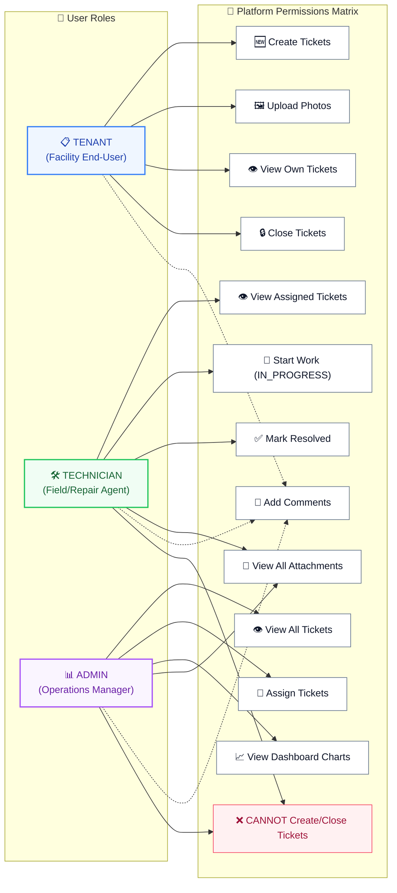

---

## 🔄 Ticket Lifecycle

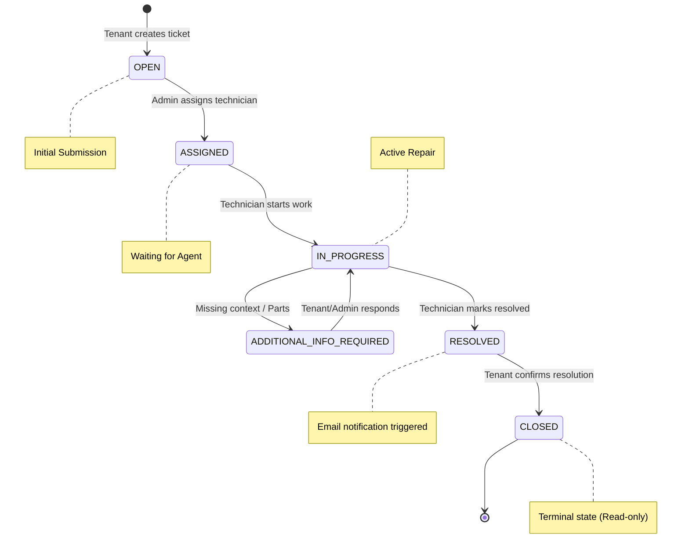

**Transition rules (enforced backend only):**

| From | To | Who triggers |
|---|---|---|
| `OPEN` | `ASSIGNED` | ADMIN — must provide `technicianId` |
| `ASSIGNED` | `IN_PROGRESS` | TECHNICIAN — must be the assigned technician |
| `IN_PROGRESS` | `RESOLVED` | TECHNICIAN — must be the assigned technician |
| `RESOLVED` | `CLOSED` | TENANT — must be the ticket creator |

Any other combination → `400 Bad Request` with `"Invalid transition: {FROM} cannot move to {TO}"`

---

## 📡 API Reference

Base URL: `http://localhost:8081/api/v1`

All responses follow the envelope:
```json
{
  "success": true,
  "message": "Human readable message",
  "data": { }
}
```

### Auth

| Method | Endpoint | Role | Description |
|---|---|---|---|
| `POST` | `/auth/sync` | Any | Idempotent — creates user on first login, returns profile on subsequent calls |
| `GET` | `/auth/me` | Any | Returns current user's DB profile |

### Tenant — Tickets

| Method | Endpoint | Role | Description |
|---|---|---|---|
| `POST` | `/tickets` | TENANT | Create a new ticket |
| `GET` | `/tickets/my` | TENANT | Paginated list of own tickets with filters |
| `GET` | `/tickets/{id}` | TENANT | Full ticket detail including comments and attachments |
| `PUT` | `/tickets/{id}/close` | TENANT | `RESOLVED → CLOSED` |
| `POST` | `/tickets/{id}/comments` | All roles | Add a comment to the activity thread |
| `GET` | `/tickets/{id}/comments` | All roles | Get all comments ordered by time |
| `POST` | `/tickets/{id}/upload-url` | TENANT | Get presigned S3 PUT URL |
| `POST` | `/tickets/{id}/attachments` | TENANT | Confirm upload, save S3 metadata |
| `GET` | `/tickets/{id}/attachments/{attId}/view` | All roles | Get fresh presigned S3 GET URL |

### Technician

| Method | Endpoint | Role | Description |
|---|---|---|---|
| `GET` | `/technician/tickets` | TECHNICIAN | Paginated list of assigned tickets |
| `PUT` | `/technician/tickets/{id}/start` | TECHNICIAN | `ASSIGNED → IN_PROGRESS` |
| `PUT` | `/technician/tickets/{id}/resolve` | TECHNICIAN | `IN_PROGRESS → RESOLVED` |

### Admin

| Method | Endpoint | Role | Description |
|---|---|---|---|
| `GET` | `/admin/tickets` | ADMIN | All tickets with filters and pagination |
| `PUT` | `/admin/tickets/{id}/assign` | ADMIN | `OPEN → ASSIGNED` with technician selection |
| `GET` | `/admin/technicians` | ADMIN | All technicians for assign dropdown |
| `GET` | `/admin/dashboard/stats` | ADMIN | Status counts + category/priority breakdowns |

📖 Full interactive API docs available at `http://localhost:8081/swagger-ui.html` when running locally.

---

## 🔒 Security Design

### JWT Flow

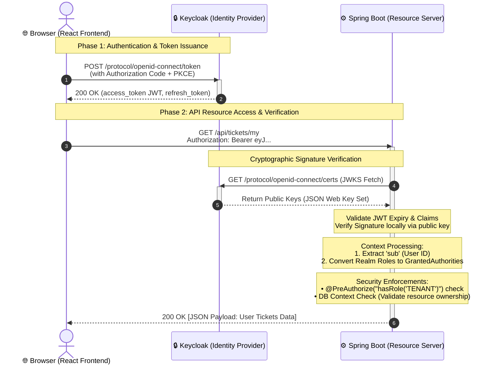

### Two Layers of Authorization

**Layer 1 — Role check** (`@PreAuthorize` at controller level):
```
"Can a TECHNICIAN call this endpoint at all?"
→ Handled by Spring Security
```

**Layer 2 — Ownership check** (inside service methods):
```
"Can THIS technician act on THIS specific ticket?"
→ Handled in service layer manually
→ Cannot be expressed with @PreAuthorize alone
```

### AWS IAM Policy (Least Privilege)

The app's IAM user has access to exactly one action on exactly one path:

```json
{
  "Statement": [
    {
      "Effect": "Allow",
      "Action": ["s3:PutObject", "s3:GetObject"],
      "Resource": "arn:aws:s3:::fixit-attachments-bucket/tickets/*"
    }
  ]
}
```

No `ListBucket`, no `DeleteObject`, no other buckets, no other AWS services.

---

## ☁️ AWS Integration

### S3 — Secure File Storage

The presigned URL pattern keeps files private while allowing direct browser uploads:

```
Step 1  →  POST /tickets/{id}/upload-url    (get permission)
Step 2  →  PUT  presigned-url               (direct browser → S3, skips backend)
Step 3  →  POST /tickets/{id}/attachments   (save s3Key to DB)
Step 4  →  GET  /tickets/{id}/attachments/{id}/view  (fresh URL per view)
```

**Key design decisions:**
- S3 bucket has **zero public access** — all files are private
- Only the `s3Key` is stored in DB — never the URL (URLs expire, keys don't)
- View URL generated fresh on every request — never cached
- `Content-Type` is locked in the presigned URL signature — S3 rejects mismatches
- CORS configured to allow PUT only from the frontend origin

### SES — Transactional Email (Future Scope)

Triggered asynchronously via Spring Events — business logic never waits for email:

| Trigger | Recipient | Subject |
|---|---|---|
| Ticket assigned | Technician | "New ticket assigned: {ticketNumber}" |
| Status changed to IN_PROGRESS | Tenant | "Work started on: {ticketNumber}" |
| Status changed to RESOLVED | Tenant | "Your ticket {ticketNumber} is resolved" |

### Other Services

| Service | Usage |
|---|---|
| **Amazon IAM** | Least-privilege policy for S3 access |

---

## 🧩 Design Patterns

### Adapter Pattern — FileStorageService

AWS S3 SDK is wrapped behind a clean interface:

```
FileStorageService (interface)
    └── S3FileStorageService (implementation)
            └── AWS SDK v2 S3Presigner
```

**Why:** `TicketAttachmentService` depends on the interface, not the SDK. S3 can be swapped for any other provider without touching business logic. Unit tests mock the interface — no AWS credentials needed in CI.

---

### Specification Pattern — Dynamic JPA Queries

Admin ticket filtering with 3 optional parameters avoids combinatorial query explosion:

```
GET /admin/tickets?status=OPEN&category=PLUMBING&priority=HIGH
```

Each filter becomes a `Specification<Ticket>` predicate. Only non-null filters are added to the `WHERE` clause. One repository method handles all combinations.

---

### Builder Pattern — Lombok `@Builder`

All DTOs and entities with 5+ fields use `@Builder`. No telescoping constructors. Field names in construction code make intent clear.

---

### Repository Pattern

`JpaRepository` provides the full Repository pattern implementation. Custom queries use JPQL named methods or `@Query` annotations — never raw SQL strings.

---

## 📁 Project Structure

### Backend

```
backend/
└── src/main/java/com/app/
    ├── auth/                     User profile sync, JWT extraction
    │   ├── controller/           AuthController
    │   ├── service/              UserService (idempotent sync)
    │   ├── repository/           UserRepository
    │   ├── entity/               User.java
    │   └── dto/                  UserProfileDTO
    │
    ├── ticket/                   Core business domain
    │   ├── controller/           TicketController, TechnicianController, AdminTicketController
    │   ├── service/              TicketService (transitions), TicketCommentService, DashboardService
    │   ├── repository/           TicketRepository (Specifications), CommentRepository
    │   ├── entity/               Ticket, TicketComment, TicketAttachment + enums
    │   ├── specification/        TicketSpecification (dynamic admin filters)
    │   └── dto/                  TicketSummaryDTO, TicketDetailDTO, CommentResponse, etc.
    │
    ├── storage/                  AWS S3 integration (Adapter pattern)
    │   ├── service/              FileStorageService (interface), S3FileStorageService
    │   └── dto/                  PresignedUrlRequest/Response, AttachmentConfirmRequest
    │
    ├── notification/             Async event-driven emails
    │   ├── event/                TicketStatusChangedEvent, TicketAssignedEvent
    │   ├── listener/             NotificationListener (@Async @EventListener)
    │   └── service/              EmailService (SES)
    │
    └── common/                   Shared infrastructure
        ├── exception/            GlobalExceptionHandler, custom exceptions
        ├── response/             ApiResponse<T>, PagedResponse<T>
        ├── config/               SecurityConfig, S3Config, CorsConfig, OpenApiConfig
        ├── audit/                AuditLog entity, AuditService, AuditAspect (@AOP)
        └── util/                 TicketNumberGenerator, DateUtil

resources/
└── db/changelog/
    ├── db.changelog-master.yaml
    └── changes/
        ├── 001-create-users-table.yaml
        ├── 002-create-tickets-table.yaml
        ├── 003-create-ticket-comments-table.yaml
        └── 004-create-ticket-attachments-table.yaml
```

### Frontend

```
frontend/
└── src/
    ├── api/                      HTTP functions per domain
    │   ├── axios.js              Instance + JWT interceptor + token refresh
    │   ├── authApi.js            sync, me
    │   ├── ticketApi.js          Tenant + Technician ticket calls
    │   ├── adminApi.js           Admin dashboard, assign, technicians
    │   └── attachmentApi.js      Presigned URL flow, S3 direct PUT, confirm
    │
    ├── auth/                     Authentication layer
    │   ├── keycloak.js           Singleton Keycloak instance
    │   ├── AuthProvider.jsx      init() with check-sso, useRef double-init guard
    │   └── ProtectedRoute.jsx    Role + auth status gate for every route
    │
    ├── store/                    Redux Toolkit
    │   ├── index.js              configureStore
    │   └── slices/
    │       ├── authSlice.js      status, profile, error
    │       ├── ticketSlice.js    list, detail, action states + thunks
    │       └── adminSlice.js     admin list, technicians, stats + thunks
    │
    ├── hooks/                    Custom hooks — components never touch Redux directly
    │   ├── useAuth.js            Redux auth state + Keycloak actions
    │   ├── useTickets.js         Ticket list fetch, filters, pagination
    │   ├── useTicketDetail.js    Single ticket fetch, status actions, comments
    │   ├── useAdminTickets.js    Admin list fetch, assign action
    │   ├── useAdminStats.js      Dashboard stats fetch
    │   └── useAttachments.js     3-step S3 upload, fresh view URL generation
    │
    ├── components/
    │   ├── layout/               AppShell, Sidebar, Header, MobileDrawer
    │   ├── tickets/              StatusBadge, PriorityBadge, TicketCard, TicketTable,
    │   │                         FilterBar, CreateTicketModal, AssignModal,
    │   │                         AttachmentUploader, AttachmentGallery, EmptyTickets
    │   └── ui/                   UserAvatar, LoadingScreen, ErrorBoundary,
    │                             TicketCardSkeleton, TableSkeleton, ConfirmDialog
    │
    ├── pages/
    │   ├── LoginPage.jsx         Split-panel with Keycloak redirect
    │   ├── ProfilePage.jsx       Account info, sign out
    │   ├── tenant/               MyTicketsPage, TicketDetailPage
    │   ├── technician/           AssignedTicketsPage
    │   └── admin/                AdminDashboardPage (Recharts), AllTicketsPage
    │
    ├── validation/               Zod schemas
    │   ├── ticketSchema.js       createTicketSchema
    │   └── assignTicketSchema.js assignTicketSchema
    │
    ├── utils/
    │   ├── avatarUtils.js        getInitials("Priya Sharma") → "PS"
    │   ├── dateUtils.js          formatDistanceToNow, formatDateTime
    │   ├── errorUtils.js         getErrorMessage, buildToast
    │   └── constants.js          Enums, color maps, role-home mapping
    │
    └── theme/
        └── index.js              Chakra extendTheme — Inter font, brand orange, AWS colors
```

---

## 🚀 Local Setup

### Prerequisites

| Tool | Version | Download |
|---|---|---|
| Java | 21+ | [OpenJDK](https://adoptium.net/) |
| Maven | 3.9+ | [maven.apache.org](https://maven.apache.org/) |
| Node.js | 20 LTS | [nodejs.org](https://nodejs.org/) |
| Docker Desktop | Latest | [docker.com](https://www.docker.com/) |
| Postman | Any | [postman.com](https://www.postman.com/) |

### Step 1 — Clone the repository

```bash
git clone https://github.com/yourusername/fixit-system.git
cd fixit-system
```

### Step 2 — Start infrastructure

This starts PostgreSQL, Keycloak, and Redis in Docker:

```bash
docker compose up -d postgres keycloak
```

Wait ~30 seconds for Keycloak to be ready, then verify:
```bash
# PostgreSQL
docker compose logs postgres | grep "ready to accept connections"

# Keycloak
curl -s http://localhost:8180/health | grep '"status":"UP"'
```

### Step 3 — Configure Keycloak realm

1. Open http://localhost:8180
2. Login with `admin` / `admin`
3. Create realm → `fixit-realm`
4. Create roles → `TENANT`, `TECHNICIAN`, `ADMIN`
5. Create client → `fixit-frontend` (public, PKCE enabled)
   - Valid redirect URIs: `http://localhost:5173/*`
   - Web origins: `http://localhost:5173`
6. Create test users (one per role):

| Username | Password | Role |
|---|---|---|
| `tenant1` | `password` | TENANT |
| `technician1` | `password` | TECHNICIAN |
| `admin1` | `password` | ADMIN |

### Step 4 — Configure environment variables

**Backend** — set these in IntelliJ Run Configuration or export in your shell:

```bash
export AWS_ACCESS_KEY_ID=your_access_key_id
export AWS_SECRET_ACCESS_KEY=your_secret_access_key
export AWS_REGION=ap-south-1
export S3_BUCKET_NAME=fixit-attachments-yourname
```

**Frontend** — create `frontend/.env`:

```env
VITE_KEYCLOAK_URL=http://localhost:8180
VITE_KEYCLOAK_REALM=fixit-realm
VITE_KEYCLOAK_CLIENT_ID=fixit-frontend
VITE_API_BASE_URL=http://localhost:8081/api/v1
```

### Step 5 — Start the backend

```bash
cd backend
mvn spring-boot:run
```

Liquibase runs all migrations automatically on startup. Verify:
```
Started BackendApplication in X.XXX seconds
```

Swagger UI: http://localhost:8081/swagger-ui.html

### Step 6 — Start the frontend

```bash
cd frontend
npm install
npm run dev
```

App: http://localhost:5173

---

## 🔧 Environment Variables

### Backend

| Variable | Required | Description |
|---|---|---|
| `AWS_ACCESS_KEY_ID` | ✅ Yes | IAM user access key for S3 |
| `AWS_SECRET_ACCESS_KEY` | ✅ Yes | IAM user secret key |
| `AWS_REGION` | ✅ Yes | AWS region (e.g. `ap-south-1`) |
| `S3_BUCKET_NAME` | ✅ Yes | S3 bucket name for attachments |
| `SPRING_DATASOURCE_URL` | ✅ Yes | PostgreSQL JDBC URL |
| `SPRING_DATASOURCE_USERNAME` | ✅ Yes | DB username |
| `SPRING_DATASOURCE_PASSWORD` | ✅ Yes | DB password |

### Frontend

| Variable | Required | Description |
|---|---|---|
| `VITE_KEYCLOAK_URL` | ✅ Yes | Keycloak server base URL |
| `VITE_KEYCLOAK_REALM` | ✅ Yes | Keycloak realm name |
| `VITE_KEYCLOAK_CLIENT_ID` | ✅ Yes | Public client ID |
| `VITE_API_BASE_URL` | ✅ Yes | Spring Boot backend URL |

> ⚠️ **Never commit `.env` files or AWS credentials to Git.** The `.env` file and any file containing `AWS_SECRET_ACCESS_KEY` are in `.gitignore`.

---

## 🧪 Running Tests

### Backend

```bash
cd backend

# All tests
mvn test

# Unit tests only (fast, no Docker required)
mvn test -Dgroups=unit

# Integration tests (requires Docker for Testcontainers)
mvn test -Dgroups=integration

# With coverage report
mvn verify
# Report at: target/site/jacoco/index.html
```

### What's tested

| Layer | Tool | Covers |
|---|---|---|
| Service layer | JUnit 5 + Mockito | Business rules, transition validation, ownership checks |
| Repository layer | Testcontainers (real PostgreSQL) | JPA queries, Liquibase migrations |
| Controller layer | MockMvc | 401/403 enforcement, request validation, response shape |
| S3 | Mockito (mocked S3Client) | Key validation, URL generation logic |

### Frontend

```bash
cd frontend

# Type check (if using TypeScript)
npm run lint

# Production build validation
npm run build
```

---

## 📸 Screenshots

### 🔐 Authentication

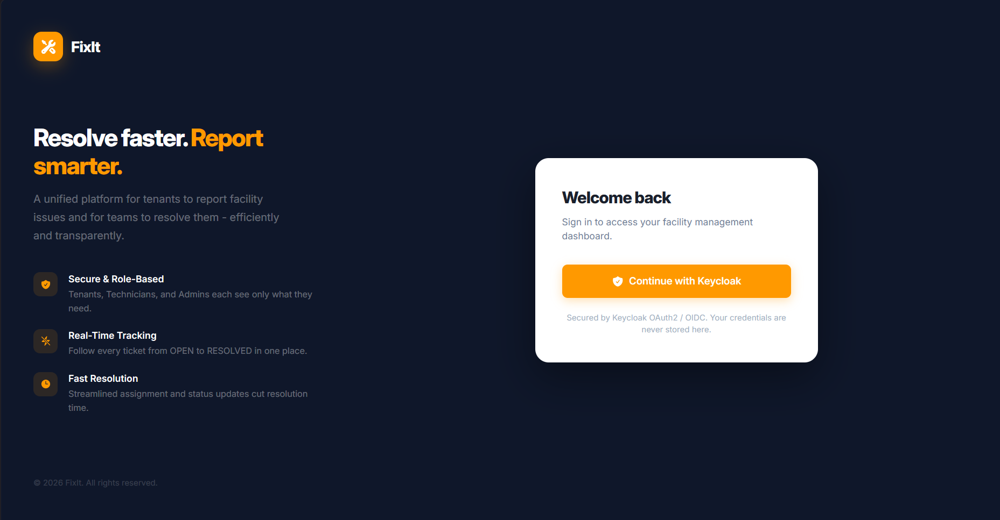

> Split-panel login - branding on the left, Keycloak OAuth2 sign-in card on the right.

---

### 👤 Tenant - My Tickets

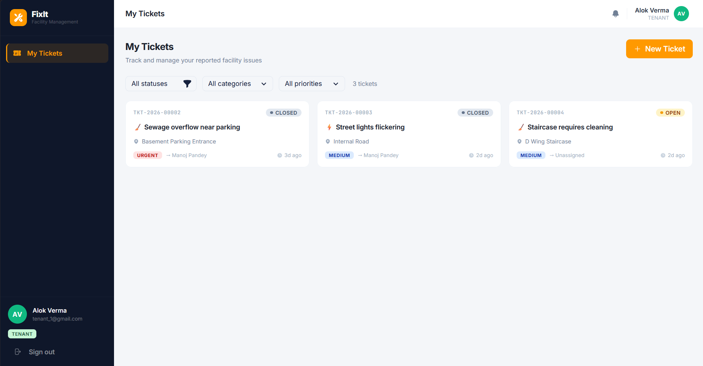

> Card grid with status badges, priority pills, category filters, and pagination.

---

### 🎫 Create Ticket

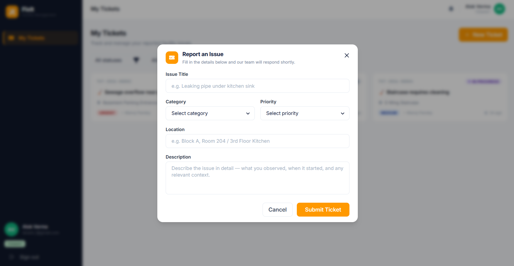

> Modal form with Zod validation - title, category, priority, location, and description.

---

### 🔍 Ticket Detail

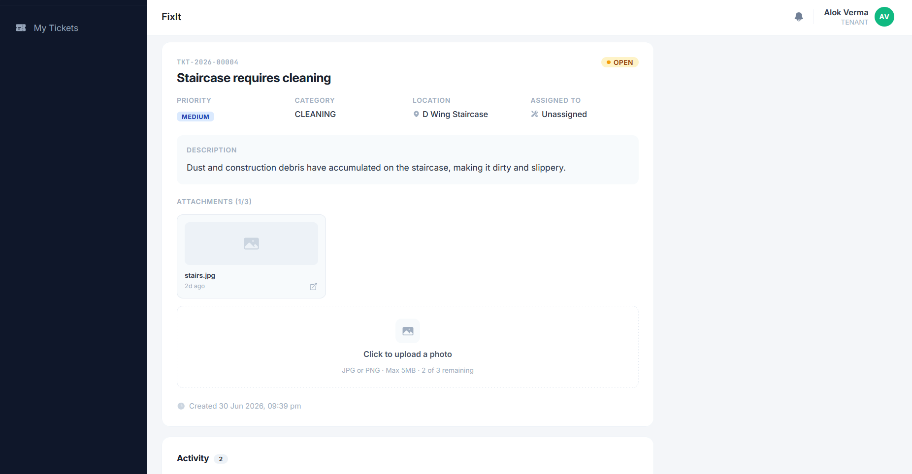

> Full ticket view - metadata, photo gallery, activity thread with role-labelled comments,
> and role-based action buttons (Start Work / Resolve / Close).

---

### 🛠️ Technician - Assigned Tickets

<table>
  <tr>
    <td width="50%">
      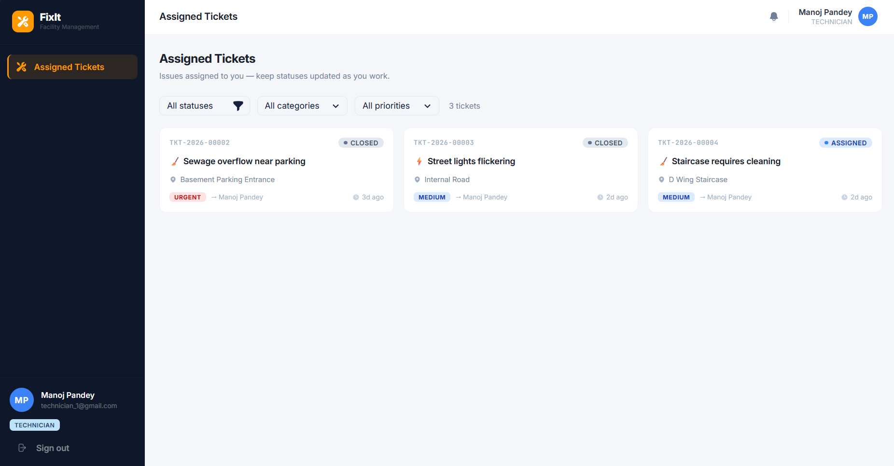
      <p align="center"><em>Assigned tickets list</em></p>
    </td>
    <td width="50%">
      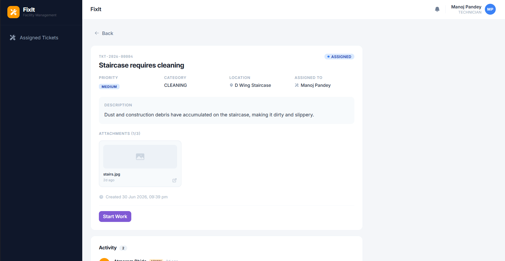
      <p align="center"><em>Starting work - ASSIGNED → IN_PROGRESS</em></p>
    </td>
  </tr>
</table>

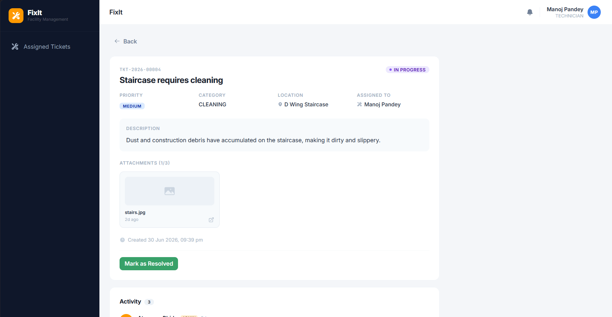

> Technician marks the ticket resolved - triggers an email notification to the tenant via AWS SES.

---

### 📊 Admin - Dashboard

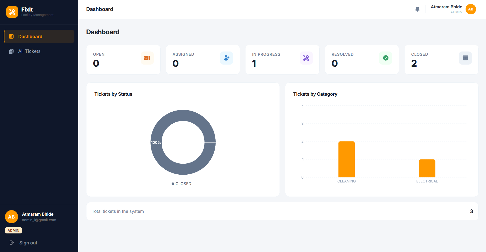

> Live stat cards + Recharts pie chart (by status) and bar chart (by category).
> Data fetched from three `GROUP BY` aggregate queries - no N+1.

---

### 📋 Admin - All Tickets

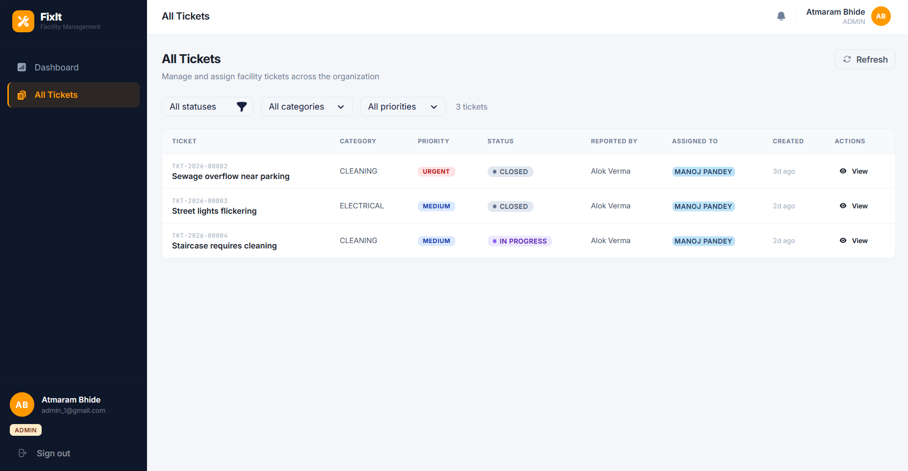

> Sortable table with dynamic filters. Click **Assign** on any OPEN ticket to open
> the technician selection modal - transitions ticket to ASSIGNED instantly.

---

## 📄 License

This project is intended as a portfolio demonstration. Feel free to use it as a reference for your own projects.

---

<div align="center">

**Built with ☕ Java, ⚛️ React, and ☁️ AWS**

</div>